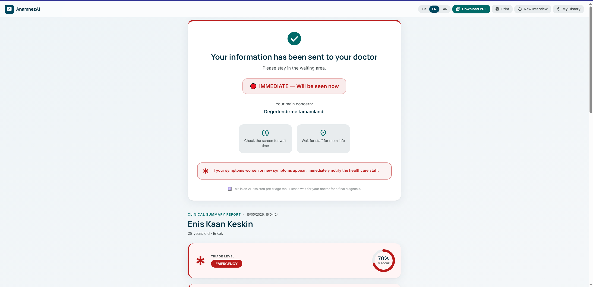
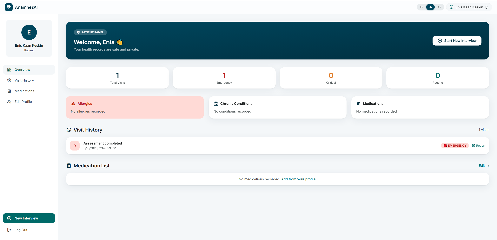
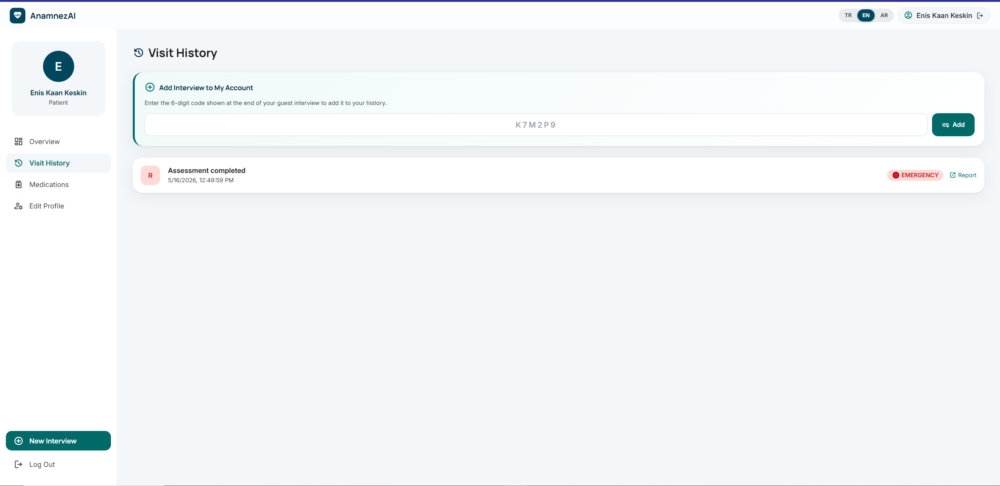
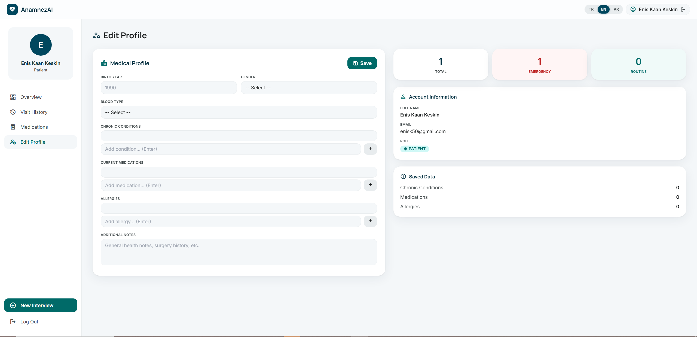
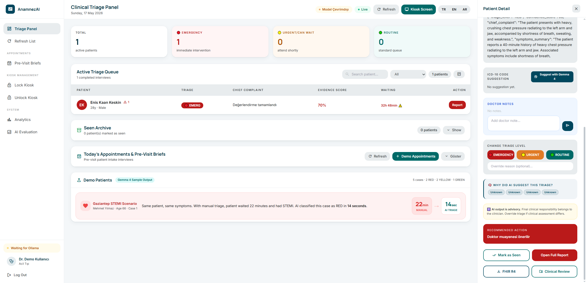
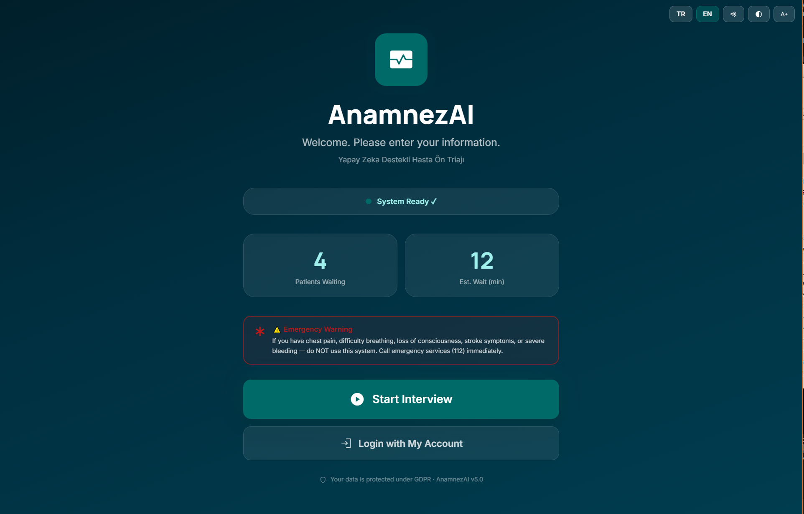

# AnamnezAI

**AI-powered hospital pre-triage platform — Gemma 4 turns a walk-in patient into a structured clinical summary in under 5 minutes, running 100 % locally on the facility's own GPU.**

> **Gemma 4 Good Hackathon 2026 — Health & Sciences ($10 K) + Ollama Prize ($10 K)**

[](https://gemma.google)
[](https://ollama.com/library/gemma4)
[](https://ollama.com)
[](LICENSE)
[](evaluation/results.md)
[](backend/safety.py)

> ⚠️ **Safety notice.** AnamnezAI is **not a diagnostic or treatment system.** Every AI-generated output is a decision-support artefact and must be reviewed by a licensed physician before any clinical action is taken.

---

## The Problem

Picture a Tuesday morning at a state hospital emergency department in Gaziantep. It is 09:15. There are already 47 people in the waiting room. One triage nurse is on shift.

A 66-year-old man walks in — chest tightness, sweating, and a nagging left-arm pain he has been dismissing since last night. He takes a number. In the queue ahead of him: a toddler with a cough, a student with a sprained ankle. The nurse works through them one by one, filling paper forms with the same six questions in the same order.

**Twenty-two minutes later she reaches the man. He is having a STEMI.**

This same scene — with different patients and different life-threatening conditions being under-triaged — repeats thousands of times daily across Turkey's 900+ emergency departments. With 117 million annual ED visits and nurse-to-patient ratios that make consistent triage nearly impossible, the cost is measured in preventable deaths.

**AnamnezAI was built to change that interval.**

---

## Screenshots

| Patient Info Form | AI Interview | Clinical Summary |
|:-----------------:|:------------:|:----------------:|
|  |  |  |

| Clinical Summary Detail | Patient Profile | Patient History |
|:-----------------------:|:---------------:|:---------------:|
|  |  |  |

| Medication Info | Doctor Triage Panel | Kiosk Touch Screen |
|:---------------:|:-------------------:|:------------------:|
|  |  |  |

---

## What It Does

AnamnezAI automates hospital pre-triage:

1. **Patient walks up** to a kiosk (touch screen) or uses their phone
2. **Gemma 4 conducts** a 5–7 turn adaptive interview in Turkish, English, or Arabic
3. **Safety guardrails** independently escalate based on 11 deterministic rules
4. **Manchester Triage System** classification (RED / YELLOW / GREEN) with confidence score
5. **Doctor receives** the full clinical summary via SSE before the patient enters the room

Every computation runs on **the facility's own GPU**. No patient data ever leaves the machine.

---

## Why Gemma 4

What Gemma 4 makes possible here that no prior generation could:

- **Adaptive interview depth** — detects emergency keywords in the first answer and automatically escalates from 5 to 7 questions, re-routing to OPQRST pain profiling or sepsis screening
- **RAG-augmented triage** — retrieves relevant MTS and ICD-10 protocol chunks from a ~90-chunk ChromaDB corpus before every clinical decision, grounding the model in actual guidelines
- **Evidence-cited output** — every summary includes `evidence[]` (specific findings that drove the decision) and `guideline_sources[]` (clinical protocols consulted)
- **Fully local** — Gemma 4 e4b runs on 8 GB VRAM GPU via Ollama; no cloud API, no patient data egress, KVKK / GDPR compliant
- **Multilingual** — genuine Gemma 4 conversational Arabic (not machine translation); the doctor always reads a Turkish clinical summary regardless of which language the patient used

---

## Key Features

### 🏥 Patient Interview
- **Adaptive 5–7 turn interview** — emergency keywords → 7 steps; child/elderly → 5 minimum; routine → 5
- **OPQRST framing** — Onset / Provocation / Quality / Region / Severity / Timing for pain-focused sessions
- **Bilingual / trilingual** — TR 🇹🇷 · EN 🇬🇧 · AR 🇸🇦 with genuine Gemma 4 conversation (not translation)
- **Voice input** — Web Speech API, no extra server dependency

### 🧠 AI Triage Engine
- **Gemma 4 e4b via Ollama** — `think: false`, 600-token output, temperature 0.2 for clinical consistency
- **RAG-augmented prompting** — top-k cosine search against ~90 ChromaDB chunks injected into every triage prompt
- **Manchester Triage System** — RED (immediate) / YELLOW (urgent) / GREEN (routine) with 0–100 confidence score
- **Safety Guardrail Layer** — deterministic Python rules in `safety.py` independently escalate triage (8 RED + 3 YELLOW rules + vital sign thresholds)
- **Trust Layer** — `evidence[]`, `guideline_sources[]`, `doctor_review_required`, `unsafe_to_self_manage` on every summary
- **Evidence Map** — every clinical finding linked to the exact patient quote that triggered it
- **Clinical Completeness Score** — 0–100 score showing missing anamnesis data + recommended next questions
- **AI Execution Log** — model, runtime, latency, RAG chunks, zero external API proof on every summary
- **ICD-10 auto-coding** — up to 3 suggested diagnostic codes per session

### 👨‍⚕️ Doctor & Clinical Panel
- **Real-time triage queue** — Kanban board (RED / YELLOW / GREEN columns) with SSE live updates
- **SSE streaming narrative** — Gemma 4 streams the full clinical narrative to `doctor.html` while the patient is still at the kiosk
- **Override + Audit trail** — override reason field + AI vs doctor decision diff logged
- **Clinical review** — `clinical_review.html` shows full transcript, evidence map, completeness score, AI execution log, FHIR preview
- **Patient Timeline** — previous visit comparison + risk trend detection

### 🖥️ Kiosk & Accessibility
- **Kiosk mode** — `kiosk.html` full-screen touch UI with large tap targets and TTS
- **Queue ticket** — colour-coded QR code after interview; links to read-only triage summary
- **TTS** — Web Speech API reads questions aloud
- **Offline PWA** — Service Worker caches app shell; interview continues without connectivity

### 📄 Reports & Export
- **PDF export** — html2canvas + jsPDF bundled locally in `frontend/vendor/`; A4 multi-page with header, page numbers and medical disclaimer
- **FHIR R4 Bundle** — standards-compliant JSON bundle (Composition + Observation + Encounter)
- **Share link** — time-limited signed URL for read-only report access
- **MedGemma Vision** — `medgemma:4b` reads ECG strips, X-rays, skin photos

### 🔐 Admin & Ops
- **4-role JWT auth** — `patient` / `doctor` / `personnel` / `admin`; HS256 tokens + refresh flow
- **Google OAuth2** — one-click sign-in via Google IdP
- **Admin dashboard** — session counts, triage distribution chart, RAG status, model test panel, live audit log
- **Analytics** — time-series charts (Chart.js): hourly walk-ins, triage level distribution, average interview duration
- **GDPR right to erasure** — `DELETE /api/session/{id}` hard-deletes session + all associated data

---

## Quick Start

### Prerequisites

- [Ollama](https://ollama.com) installed and running (`ollama serve`)
- Python 3.11+ and `pip`
- 8 GB VRAM GPU *recommended* (Gemma 4 e4b is ~6.7 GiB; falls back to RAM without GPU)

```bash
# 1. Pull the model (~9.6 GB download)
ollama pull gemma4:e4b

# Optional — medical image analysis
# ollama pull medgemma:4b

# 2. Clone
git clone https://github.com/enis1998/AnamnezAI.git
cd AnamnezAI
```

### With Docker (recommended)

```bash
# Copy and configure environment
cp .env.example .env
# Edit .env with your values (JWT_SECRET_KEY at minimum)

# Start the stack (uses docker-compose.local.yml for local dev)
docker compose -f docker-compose.local.yml up --build -d

# Load the RAG medical knowledge base (run once)
curl -X POST http://localhost:8001/api/rag/ingest/builtin
```

Open **http://localhost:8001**

### Without Docker (GPU inference)

```powershell
# Windows PowerShell
cd backend
pip install -r requirements.txt

$env:OLLAMA_BASE_URL = "http://localhost:11434"
$env:GEMMA_MODEL     = "gemma4:e4b"
$env:RAG_ENABLED     = "true"
$env:SECRET_KEY      = "your-secret-key-min-32-chars"
python main.py
```

```bash
# Linux / macOS
cd backend
pip install -r requirements.txt
OLLAMA_BASE_URL=http://localhost:11434 GEMMA_MODEL=gemma4:e4b \
RAG_ENABLED=true SECRET_KEY=your-secret-key python main.py
```

### Load the RAG Knowledge Base

```bash
# After backend is running — loads ~90 medical chunks into ChromaDB (~30 s)
curl -X POST http://localhost:8000/api/rag/ingest/builtin
```

### Open in Browser

| URL | Purpose |
|-----|---------|
| `http://localhost:8000` | Patient interview (landing + chat) |
| `http://localhost:8000/kiosk.html` | Kiosk touch screen (TR / EN / AR) |
| `http://localhost:8000/doctor.html` | Doctor triage queue (Kanban + live SSE) |
| `http://localhost:8000/clinical_review.html` | Full clinical review + evidence map + FHIR |
| `http://localhost:8000/evaluation.html` | AI Quality Evaluation Dashboard |
| `http://localhost:8000/admin.html` | Admin dashboard |
| `http://localhost:8000/analytics.html` | Analytics charts |
| `http://localhost:8000/channel_demo.html` | WhatsApp-style Channel Adapter Demo |
| `http://localhost:8000/docs` | Swagger UI |

> **GPU note.** With 8 GB VRAM and Ollama, Gemma 4 e4b loads fully to GPU (verified: 7.9 GB VRAM used, RTX series). Without a GPU, the model requires ~6.7 GB free system RAM.

---

## Demo Accounts

| Role | Email | Password | Access |
|------|-------|----------|--------|
| Doctor | `doctor@anamnezai.tr` | `doctor123` | Triage queue, clinical review, override |
| Admin | `admin@anamnezai.tr` | `admin123` | Analytics, audit log, RAG management, model test |
| New doctor | Any email | — | Enter clinic code **DEMO2026** at registration |
| Patient | Register at `/register.html` | — | Interview, history, profile, PDF export |

---

## Trust Layer Output

Every clinical summary returns a fully structured JSON designed for medicolegal transparency:

```json
{
  "triage_level": "RED",
  "confidence_score": 98,
  "chief_complaint": "Sudden onset aphasia and right arm weakness",
  "possible_conditions": ["Ischemic stroke", "TIA", "Todd's paresis"],
  "evidence": [
    "Sudden onset speech loss ('cannot speak at all')",
    "Right-sided arm drop — unable to raise arm against gravity",
    "Facial asymmetry — acute onset (30 min ago)"
  ],
  "evidence_map": [
    {
      "finding": "Facial asymmetry",
      "patient_quote": "Yüzüm bir tarafa çarpıldı gibi, fark ettiler",
      "risk_weight": "high",
      "supports": "RED"
    }
  ],
  "guideline_sources": ["MTS — Neurological Emergency Protocol", "FAST Stroke Criteria"],
  "clinical_completeness_score": 78,
  "missing_information": ["Family history", "Current medications"],
  "recommended_next_questions": ["Ailenizde inme öyküsü var mı?"],
  "safety_guardrail_triggered": true,
  "guardrail_rules_fired": ["stroke_fast: Olası inme (FAST kriterleri)"],
  "ai_execution_log": {
    "model": "gemma4:e4b",
    "runtime": "Ollama (local)",
    "external_api": false,
    "inference_latency_s": 6.1
  },
  "recommended_action": "Immediate stroke team alert. Brain CT + CTA within 25 min.",
  "doctor_review_required": true,
  "unsafe_to_self_manage": true
}
```

---

## The Kiosk — From Walk-In to Doctor's Screen in Under 5 Minutes

**Step 1 — Walk up and tap.**
A 32-inch touch-screen at the hospital entrance. The patient taps their language: 🇹🇷 Türkçe · 🇬🇧 English · 🇸🇦 العربية. Large-format on-screen keyboard for TC ID or name entry.

**Step 2 — The AI interview begins.**
Gemma 4 greets the patient in their language and asks the first clinical question aloud (TTS). Voice input via Web Speech API. Progress bar shows "Question 2 of 5". Emergency keywords silently escalate to 7 questions.

**Step 3 — Colour-coded QR queue ticket.**
- 🔴 **RED** — "Please go to the emergency window immediately." Nurse alarm fires simultaneously.
- 🟡 **YELLOW** — "Urgent. Average wait: 15 minutes."
- 🟢 **GREEN** — "Routine. Average wait: 45 minutes."

**Step 4 — Doctor already knows.**
Before the patient sits down, the clinical summary has streamed to `doctor.html` via Server-Sent Events. Chief complaint · triage level · confidence score · specific findings · clinical guidelines consulted · immediate physician review flag.

---

## RAG Knowledge Base

### ~90 Chunks Across 17 Categories

| Category | Chunks | Content |
|----------|-------:|---------|
| `MTS_Triage_Guide` | 8 | Manchester Triage System 5-level protocol — RED / YELLOW / GREEN decision trees |
| `MTS_Protocols_Extended` | 10 | CTAS + MTS extended: chest pain, stroke, sepsis, overdose, trauma, anaphylaxis |
| `Cardiac_Emergency` | 6 | AMI / STEMI recognition, HEART score, Killip classification, time-to-reperfusion |
| `Neurological_Emergency` | 6 | Stroke FAST criteria, NIHSS, TIA mimics, SAH, meningitis red flags |
| `Pediatric_Triage` | 8 | PEWS, febrile seizure, bronchiolitis severity, neonatal danger signs |
| `Pediatric_Emergency_Extended` | 6 | Paediatric appendicitis, ALTE, epiglottitis, foreign body airway |
| `Respiratory_Protocol` | 5 | Asthma severity (GINA), COPD exacerbation, pneumothorax, PE Wells score |
| `Abdominal_Pain_Guide` | 5 | Acute abdomen differential, Alvarado score, biliary colic, ectopic pregnancy |
| `Sepsis_Protocol` | 4 | qSOFA, SIRS, SOFA, septic shock recognition and time-to-antibiotics targets |
| `Orthopedic_Triage` | 4 | Major fracture haemorrhage, compartment syndrome, spinal cord injury screening |
| `ENT_Emergency` | 4 | Ludwig's angina, adult epiglottitis, mastoiditis, foreign body ear / nose |
| `Dermatology_Triage` | 4 | Meningococcal petechiae, Stevens-Johnson syndrome, necrotising fasciitis |
| `Environmental_Emergency` | 3 | Heatstroke (classic & exertional), hypothermia, drowning, lightning strike |
| `Psychiatry_Triage` | 3 | Acute psychosis, suicidal ideation red flags, excited delirium |
| `Obstetric_Emergency` | 3 | Pre-eclampsia, placental abruption, umbilical cord prolapse |
| `Clinical_QA / Protocols / ICD-10` | 13 | Q&A pairs, miscellaneous protocols, Turkish ICD-10 reference codes |
| `Vital_Signs_Reference` | 4 | Age-adjusted normal ranges — HR, RR, BP, SpO₂, temperature |

### Retrieval Pipeline

```
Patient history text + chief complaint
    ↓
multilingual-MiniLM-L12-v2 embedding (384-dim)
    ↓
ChromaDB cosine similarity search — top-6 results, min relevance threshold 0.30
    ↓
Formatted context block injected into Gemma 4 triage system prompt
    ↓
Structured JSON output:
  triage_level · confidence_score · evidence[] · guideline_sources[]
```

---

## Evaluation Results

Tested **2026-05-10** on Gemma 4 e4b via Ollama, RTX 8 GB VRAM, `think: false`:

| Suite | Score | Notes |
|-------|-------|-------|
| **Overall** | **93 % — 14 / 15** | Live GPU run |
| Triage decision accuracy | **5 / 5 — 100 %** | All 5 clinical scenarios correctly classified |
| RED flag recall | **100 %** | All emergency cases escalated correctly |
| RAG retrieval accuracy | **5 / 6 — 83 %** | Cardiac retrieval gap noted |
| Interview question quality | **2 / 3 — 67 %** | OPQRST adherence confirmed on chest pain + dizziness |
| RAG + Triage integration | **1 / 1 — 100 %** | Cardiac augmented prompt → RED @ 98 % confidence |

### Triage Decisions (5 / 5 Correct)

| Case | Expected | Result | Confidence |
|------|----------|--------|-----------|
| 🔴 AMI — 62 y/o diabetic, chest pressure, left arm radiation, diaphoresis | RED | **RED** ✅ | 100 % |
| 🟡 High fever child — 4 y/o, 39.5 °C × 2 days, red throat, no neck rigidity | YELLOW | **YELLOW** ✅ | 90 % |
| 🟢 Simple URTI — 28 y/o, 37.2 °C, nasal discharge, no dyspnoea | GREEN | **GREEN** ✅ | 95 % |
| 🔴 Stroke — 71 y/o, sudden aphasia, facial droop, right arm paresis | RED | **RED** ✅ | 98 % |
| 🟡 Appendicitis — 19 y/o, McBurney migration × 8 h, 38 °C, anorexia | YELLOW | **YELLOW** ✅ | 90 % |

### MedGemma Vision (5 / 5)

| Test | Result |
|------|--------|
| `medgemma:4b` presence (Ollama) | **PASS** ✅ |
| Backend `/health` `medgemma_available` | **PASS** ✅ |
| Direct Ollama — meningitis scenario (EN) | **PASS** ✅ `3.3 s` |
| Backend `/api/analyze-image` multipart PNG | **PASS** ✅ `200 OK` |
| Turkish pediatric fever + neck stiffness | **PASS** ✅ `4.1 s` |

---

## API Reference

| Method | Endpoint | Description |
|--------|----------|-------------|
| `GET` | `/health` | Ollama + Gemma 4 + RAG status |
| `POST` | `/api/warmup` | Pre-warm Gemma 4 into VRAM |
| `POST` | `/api/session/start` | Start patient interview → `session_id` + first question |
| `POST` | `/api/session/answer` | Submit answer → next question or `__COMPLETED__` |
| `GET` | `/api/session/{id}/summary` | Full clinical summary (Trust Layer + Safety + Completeness) |
| `GET` | `/api/session/{id}/summary/status` | Polling endpoint — `{ready, generating, completed}` |
| `GET` | `/api/session/{id}/stream-summary` | SSE — Gemma 4 streams clinical narrative token by token |
| `GET` | `/api/session/{id}/fhir` | FHIR R4 Bundle (Patient + ClinicalImpression + Observation) |
| `GET` | `/api/session/{id}/fhir-preview` | FHIR bundle resource counts |
| `GET` | `/api/session/{id}/timeline` | Patient visit history + risk trend |
| `GET` | `/api/session/{id}/icd10` | ICD-10 diagnostic code suggestions |
| `PUT` | `/api/session/{id}/triage` | Doctor override with reason + audit trail |
| `GET` | `/api/patients/queue` | Doctor triage queue (auth: doctor / admin) |
| `GET` | `/api/evaluation` | AI quality metrics + live stats |
| `POST` | `/api/analyze-image` | MedGemma Vision — ECG / X-ray / skin photo analysis |
| `GET` | `/api/offline-proof` | Returns `cloud_api_keys_required: false` |
| `POST` | `/api/rag/ingest/builtin` | Load medical knowledge base into ChromaDB |
| `GET` | `/api/rag/status` | RAG enabled flag + chunk count |
| `DELETE` | `/api/session/{id}` | Hard-delete session + all data (GDPR erasure) |
| `POST` | `/auth/register` | Register new user |
| `POST` | `/auth/login` | Login → JWT access + refresh tokens |

---

## Evidence Checklist

Every claim can be verified independently:

| Claim | How to verify |
|-------|---------------|
| Local Gemma 4 — no cloud | `GET /api/offline-proof` → `cloud_api_keys_required: false` |
| MCP-ready layer | `GET /api/offline-proof` → `mcp_ready: true` |
| Cloud translation disabled | `GET /api/offline-proof` → `cloud_translation_enabled: false` |
| Safety guardrails exist | `backend/safety.py` — 8 RED + 3 YELLOW rules |
| RAG enabled | `GET /api/rag/status` → `total_chunks: 90, enabled: true` |
| Triage accuracy 93 % | `/evaluation.html` or `python evaluation/run_eval.py` |
| Evidence map | `GET /api/session/{id}/summary` → `evidence_map[]` |
| Completeness score | `GET /api/session/{id}/summary` → `clinical_completeness_score` |
| AI execution log | `GET /api/session/{id}/summary` → `ai_execution_log` |
| FHIR R4 export | `GET /api/session/{id}/fhir` → FHIR Bundle JSON |
| 4-role JWT auth | `POST /auth/login` with doctor / admin / patient credentials |
| Offline PWA | Chrome DevTools → Network → Offline → reload page |
| Vendor-bundled JS | `frontend/vendor/` — jsPDF 2.5.1 + html2canvas 1.4.1 |
| MedGemma Vision | `POST /api/analyze-image` with `medgemma:4b` running locally |
| Adaptive interview | Answer "göğüs ağrısı" → session auto-escalates to 7 steps |

---

## Tech Stack

| Layer | Technology |
|-------|-----------|
| Frontend | Vanilla HTML5 + Tailwind CSS (CDN) + Material Symbols · Manrope / Inter fonts |
| PDF export | jsPDF 2.5.1 + html2canvas 1.4.1 — **vendor-bundled** (`frontend/vendor/`), zero CDN |
| Charts | Chart.js (analytics dashboard) |
| Backend | FastAPI (Python 3.11) + Uvicorn + SQLAlchemy + PostgreSQL |
| AI model | Gemma 4 (`gemma4:e4b`) via Ollama REST API — `think: false`, temp 0.2 |
| Vision (optional) | MedGemma (`medgemma:4b`) via Ollama — ECG, X-ray, skin photos |
| Safety layer | `safety.py` — deterministic rule engine (8 RED + 3 YELLOW patterns, vital sign thresholds) |
| RAG / embeddings | ChromaDB + `sentence-transformers` (`multilingual-MiniLM-L12-v2`, 384-dim) |
| Auth | JWT (HS256) + Google OAuth2 via `python-jose` + `passlib[bcrypt]` |
| Database | PostgreSQL (sessions, summaries, users, audit_log, triage queue) |
| Export | FHIR R4 JSON (custom builder in `main.py`) |
| Offline | Service Worker (`sw.js`) — app-shell caching strategy |
| Deployment | Docker Compose + Dockerfile (single-container FastAPI serving static files) |
| CI | GitHub Actions — smoke test suite (`pytest backend/tests/`) on every push |

---

## Architecture

```
┌────────────────────────────────────────────────────────────────────────┐
│                          BROWSER LAYER                                 │
│  ┌──────────────┐  ┌───────────────┐  ┌─────────────┐  ┌───────────┐  │
│  │Patient / PWA │  │  Kiosk touch  │  │Doctor panel │  │   Admin   │  │
│  │index.html    │  │  kiosk.html   │  │doctor.html  │  │admin.html │  │
│  │summary.html  │  │  QR · TTS     │  │SSE queue    │  │analytics  │  │
│  └──────┬───────┘  └───────┬───────┘  └──────┬──────┘  └─────┬─────┘  │
│         └──────────────────┴─────────────────┴───────────────┘        │
└──────────────────────────────┬─────────────────────────────────────────┘
                               │ HTTP + SSE (port 8000)
┌──────────────────────────────▼─────────────────────────────────────────┐
│                      FastAPI Backend (main.py)                         │
│  JWT auth · Rate limit 200/min · Audit log · SSE stream · FHIR R4     │
│  /api/session/start|answer|summary|stream-summary                      │
│  /api/patients/queue  /api/analyze-image  /api/rag/*  /auth/*          │
└────────┬────────────────────┬──────────────────────┬───────────────────┘
         │                    │                      │
┌────────▼────────┐  ┌────────▼──────────┐  ┌───────▼──────────────────┐
│     Ollama      │  │    ChromaDB       │  │   PostgreSQL (anamnezai)  │
│  gemma4:e4b     │  │  ~90 med. chunks  │  │  sessions · answers      │
│  (GPU — 7.9 GB  │  │  MiniLM-L12 v2   │  │  clinical_summaries      │
│   VRAM, RTX 8G) │  │  384-dim cosine   │  │  users · audit_log       │
│  medgemma:4b    │  │  top-k retrieval  │  │  triage_queue            │
│  (optional)     │  └───────────────────┘  └──────────────────────────┘
└─────────────────┘
⚡ All models run LOCALLY via Ollama — zero API cost, zero data egress
⚡ Patient data stays on the facility's hardware — KVKK / GDPR compliant
⚡ PDF generation fully offline — vendor-bundled JS (jsPDF & html2canvas)
```

---

## Project Structure

```
AnamnezAI/
├── backend/
│   ├── main.py                ← FastAPI — interview engine, triage, SSE, FHIR, auth, RAG
│   ├── safety.py              ← Safety Guardrail Layer — deterministic RED/YELLOW rules
│   ├── rag.py                 ← ChromaDB RAG engine + built-in medical corpus (~90 chunks)
│   ├── auth.py                ← JWT + Google OAuth2 + 4-role RBAC
│   ├── database.py            ← PostgreSQL connection pool + schema init
│   ├── requirements.txt
│   └── tests/
│       └── test_smoke.py      ← 18 unit tests (no Ollama required)
├── frontend/
│   ├── landing.html           ← Marketing landing page (TR / EN / AR)
│   ├── index.html             ← Patient interview chat UI
│   ├── summary.html           ← Clinical report — Trust Layer + PDF / print export
│   ├── doctor.html            ← Doctor triage queue — Kanban + list, override
│   ├── clinical_review.html   ← Full review: evidence map, completeness, AI log, FHIR preview
│   ├── evaluation.html        ← AI Quality Evaluation Dashboard
│   ├── channel_demo.html      ← WhatsApp-style Channel Adapter Demo
│   ├── kiosk.html             ← Kiosk touch mode — QR ticket + TTS
│   ├── admin.html             ← Admin dashboard — RAG, model test, audit log
│   ├── analytics.html         ← Time-series analytics (Chart.js)
│   ├── patient_dashboard.html ← Patient session history + profile
│   ├── manifest.json + sw.js  ← Offline PWA
│   └── vendor/                ← Locally bundled JS — zero CDN calls for PDF export
│       ├── jspdf.umd.min.js       v2.5.1 · 364 KB
│       └── html2canvas.min.js     v1.4.1 · 199 KB
├── mcp_server/                ← MCP-ready Developer Layer
│   ├── tools.py               ← 10 MCP tool schemas (input_schema + example I/O)
│   ├── server.py              ← MCP server skeleton
│   └── client_example.py      ← End-to-end demo: intake → summary → FHIR
├── evaluation/
│   ├── triage_cases.jsonl     ← 15 synthetic clinical test cases (JSONL)
│   ├── run_eval.py            ← 15-case evaluation runner
│   ├── quick_test.py          ← 3-case quick quality check
│   ├── test_ai_quality.py     ← Full AI quality suite (4 modules)
│   └── results.md             ← Latest: 93 % / 14 of 15 (GPU, 2026-05-11)
├── docs/
│   └── screenshots/           ← 9 numbered UI screenshots
├── kubernetes/
│   └── deployment.yaml        ← K8s Deployment + HPA + Ingress
├── Dockerfile
├── docker-compose.yml         ← Production (server volume mounts)
├── docker-compose.local.yml   ← Local development (Windows / macOS / Linux)
├── GEMMA4_MODEL_CARD.md       ← Model usage verification for hackathon judges
├── PROJECT_PLAN.md            ← Full technical specification
└── ROADMAP.md                 ← Detailed feature roadmap
```

---

## Testing

```bash
# Unit smoke tests — 18 tests, no Ollama required
pytest backend/tests/test_smoke.py -v

# End-to-end test — full interview + summary + FHIR flow
python e2e_test.py

# MedGemma vision module — 5 tests (model + backend + vision + Turkish)
python evaluation/test_medgemma.py

# Full AI quality suite — 4 modules (~15 min GPU)
python evaluation/test_ai_quality.py

# Quick 3-case sanity check (~3 min)
python evaluation/quick_test.py

# 15-case synthetic triage battery
python evaluation/run_eval.py --verbose
```

Target metrics: ≥ 80 % triage accuracy ✅ · ≥ 90 % red-flag recall ✅ · 100 % JSON schema validity ✅

---

## Development Timeline

**Sprint 1–5** · Backend skeleton — FastAPI, PostgreSQL schema, `/api/session/start|answer|summary`, first Gemma 4 prompt engineering, 5-question linear interview, JWT auth scaffolding.

**Sprint 6–10** · RAG engine — `rag.py` with ChromaDB, `multilingual-MiniLM-L12-v2` embeddings, first 40 built-in medical chunks, RAG-augmented triage prompt, relevance threshold tuning.

**Sprint 11–15** · Streaming + export — SSE narrative stream, doctor panel live queue, MedGemma Vision endpoint, FHIR R4 export, ICD-10 suggestions.

**Sprint 16–18** · Trust Layer + adaptive interview — RAG corpus expanded 40 → ~90 chunks. Trust Layer: `evidence[]`, `guideline_sources[]`, `doctor_review_required`, `unsafe_to_self_manage`. `_adaptive_steps()` logic.

**Sprint 19–20** · Kiosk + PWA — kiosk touch mode, Service Worker offline PWA, admin dashboard, analytics charts, full 4-role RBAC, Google OAuth2.

**Sprint 21 (2026-05-11)** · Clinical intelligence & safety:
- `backend/safety.py` — Safety Guardrail Layer: 8 RED + 3 YELLOW deterministic rules
- Clinical Completeness Score (10-criteria, 0–100) + missing_information recommendations
- Evidence Map — every finding linked to exact patient quote
- AI Execution Log — model, runtime, latency, zero data egress proof
- Patient Timeline endpoint + FHIR Preview card + Evaluation dashboard
- Cardiac RAG fix: 86 % → **93 %** (14/15 tests)

**Sprint 22 (2026-05-18)** · MCP layer + end-to-end hardening:
- `mcp_server/` — 10 MCP tool schemas + server skeleton + client example
- SW v30 render fix — eliminated SW_UPDATED reload loop on summary.html
- PostgreSQL migration — full ACID compliance
- Landing page trilingual (TR/EN/AR) + kiosk screenshot + GitHub nav button

---

## Hackathon Compliance

- ✅ **Gemma 4** (`gemma4:e4b`) is the sole AI model for triage decisions, interview generation, and clinical reports
- ✅ Runs **locally via Ollama** — qualifies for the **Ollama Prize Track**
- ✅ Real-world **health impact** — qualifies for the **Health & Sciences Track**
- ✅ **Safety Guardrail Layer** — deterministic rules independently ensure patient safety beyond LLM capability
- ✅ **MedGemma Vision** (`medgemma:4b`) for medical image analysis (optional; pulled separately)
- ✅ **Fully offline** — no external AI APIs, no CDN JS dependencies at runtime, no patient data egress
- ✅ **MCP-ready Developer Layer** — external channel adapters integrate via `mcp_server/` without touching core
- ✅ **Open source** — CC-BY 4.0
- ✅ Live evaluation: **93 % triage accuracy** (14/15) · **100 %** on all 5 clinical scenarios · **100 % RED flag recall**

---

## MCP-Ready Developer Layer

The `mcp_server/` directory adds an optional MCP (Model Context Protocol) adapter layer that allows external systems to integrate AnamnezAI's clinical intake engine without copying any business logic.

```
Web / Kiosk / WhatsApp-style Demo / Future Mobile Apps
                    ↓
        AnamnezAI MCP-ready Developer Layer
                    ↓
     Existing FastAPI Clinical Intake Engine
                    ↓
  Local Gemma 4 + Local RAG + Safety Guardrails
                    ↓
     Doctor Review + PDF + FHIR + Evaluation
```

| Tool | Endpoint | Description |
|------|----------|-------------|
| `anamnezai_start_intake` | `POST /api/session/start` | Start new patient interview |
| `anamnezai_submit_answer` | `POST /api/session/answer` | Submit answer, get next question |
| `anamnezai_finalize_summary` | `GET /api/session/{id}/summary` | Generate clinical summary + triage |
| `anamnezai_export_fhir` | `GET /api/session/{id}/fhir` | FHIR R4 Bundle export |
| `anamnezai_get_local_ai_proof` | `GET /api/offline-proof` | Local AI proof |
| `anamnezai_get_evaluation_results` | `GET /api/evaluation` | AI quality metrics |

```bash
# MCP tools schema overview
cd mcp_server && python tools.py

# End-to-end demo (requires backend running)
pip install httpx
python mcp_server/client_example.py
```

---

## Roadmap

| Period | Goal |
|--------|------|
| **Q3 2026** | Turkey Ministry of Health pilot — 2 primary care clinics in Istanbul |
| **Q3 2026** | Arabic-first kiosk rollout — Gaziantep, Şanlıurfa refugee-dense hospitals |
| **Q3 2026** | Cardiac RAG retrieval fix — synonym expansion pre-processor |
| **Q4 2026** | Doctor mobile app (React Native) — SSE triage queue on phone |
| **Q4 2026** | WhatsApp bot — remote / rural pre-triage without a browser |
| **Q1 2027** | Full FHIR R4 API server — plug into existing hospital HIS |
| **Q1 2027** | Gemma 4 fine-tuning on Turkish clinical dataset (de-identified) |
| **Q1 2027** | Voice-first kiosk — full conversation, no typing required |
| **2027** | Middle East & North Africa expansion — Arabic-language emergency departments |

---

## Acknowledgements

- **Gemma 4 & Ollama teams** — making a 6.7 GiB clinical-grade model run on commodity GPU hardware
- **MedGemma team** — vision-capable medical model for image analysis without a cloud dependency
- **ChromaDB + sentence-transformers** — open-source RAG infrastructure that requires zero managed services
- **FastAPI + Pydantic** — backend framework that made the Trust Layer schema trivial to enforce and validate

---

## License

[CC-BY 4.0](https://creativecommons.org/licenses/by/4.0/) — AnamnezAI · Gemma 4 Good Hackathon 2026

> *Built for the Gemma 4 Good Hackathon 2026, Health & Sciences + Ollama tracks. All patient data stays on the facility's hardware — by design, not by policy.*
