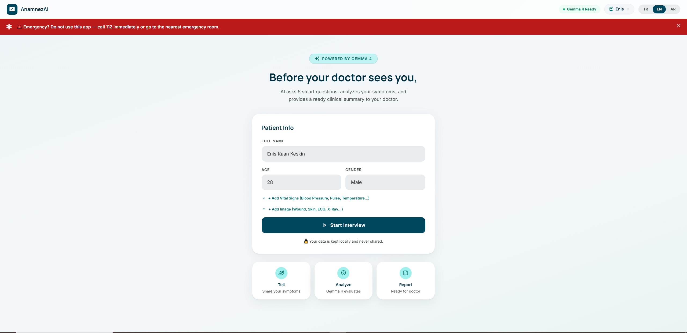
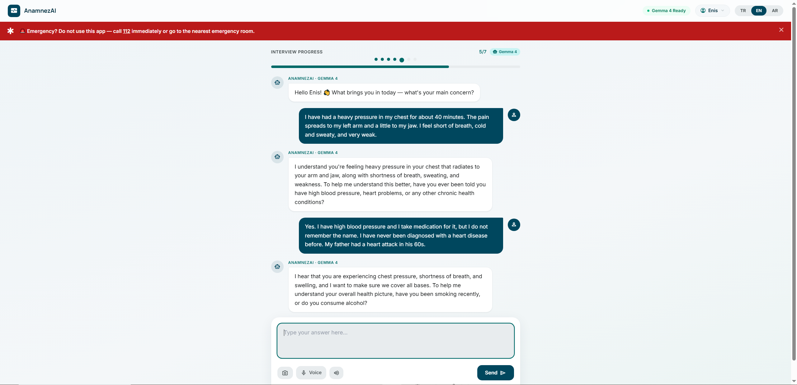
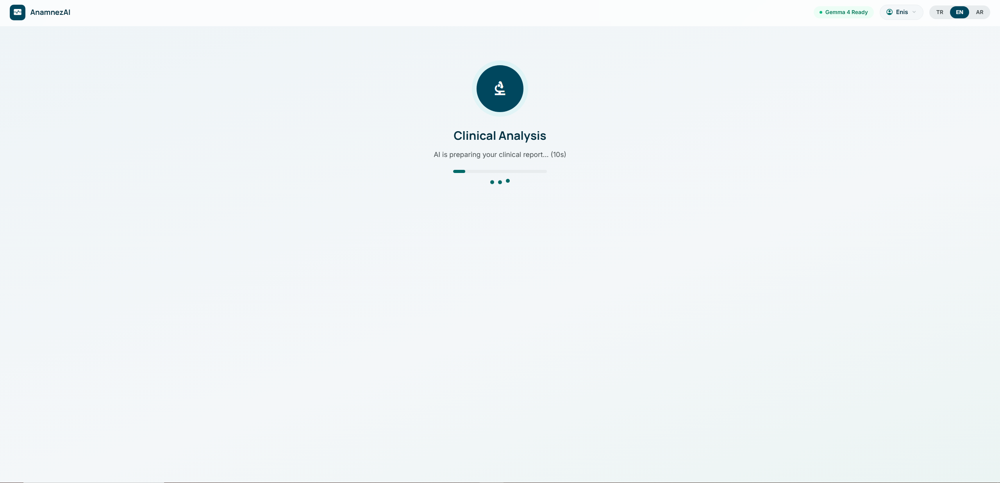

# AnamnezAI

**AI-powered medical pre-triage platform — Gemma 4 turns a hospital walk-in into a structured clinical summary in under 5 minutes, running 100 % locally on the facility's own hardware.**

> **Gemma 4 Good Hackathon 2026 — Health & Sciences ($10 K) + Ollama Prize ($10 K)**
>
> Dark-themed bilingual UI (TR 🇹🇷 · EN 🇬🇧) · 5–7 turn adaptive AI interview powered by Gemma 4 e4b via Ollama · Manchester Triage System (MTS) RED / YELLOW / GREEN classification · ~90-chunk ChromaDB RAG corpus · **Safety Guardrail Layer** (deterministic escalation rules independent of LLM) · **Clinical Completeness Score** · **Evidence Map** (patient quotes → findings) · **AI Execution Log** (local inference proof) · FHIR R4 export · SSE streaming · Kiosk touch screen · Offline PWA · 4-role JWT auth.

[](https://gemma.google)
[](https://ollama.com/library/gemma4)
[](https://ollama.com)
[](LICENSE)
[-success)](evaluation/results.md)
[](backend/safety.py)

> ⚠️ **Safety notice.** AnamnezAI is **not a diagnostic or treatment system.** Every AI-generated output is a decision-support artefact and must be reviewed by a licensed physician before any clinical action is taken.

---

## Screenshots

| Patient Info Form | AI Interview (in progress) | Clinical Summary |
|:-----------------:|:--------------------------:|:----------------:|
|  |  |  |

| Doctor Triage Queue | Kiosk Touch Screen | Clinical Review |
|:-------------------:|:------------------:|:---------------:|
|  |  |  |

| Admin Dashboard | Landing Page | Patient Registration |
|:---------------:|:------------:|:--------------------:|
|  |  |  |

---

## The Story — Why This Exists

### A waiting room no one wants to be in

Picture a Tuesday morning at a state hospital emergency department in Gaziantep. It is 09:15. There are already 47 people in the waiting room. One triage nurse is on shift.

A 66-year-old man walks in — chest tightness, sweating, and a nagging left-arm pain he has been dismissing as muscle soreness since last night. He sits down and quietly takes a number. In the queue in front of him: a toddler with a cough, a university student with a sprained ankle, a woman with a bad headache. The nurse works through them one by one, filling out paper forms, asking the same six questions in the same order regardless of what anyone says. Twenty-two minutes later she reaches the man with the chest pain.

He is having a STEMI.

The same scene — with different patients and different life-threatening conditions being under-triaged — is repeated thousands of times a day across Turkey's 900+ emergency departments. With 117 million annual ED visits nationwide and a nurse-to-patient ratio that makes consistent triage nearly impossible, the cost is measured not in waiting room frustration but in preventable deaths.

**AnamnezAI was built to change that interval — the time between a patient walking through the door and a clinician understanding what is actually wrong with them.**

---

### The language wall nobody talks about

Turkey has become one of the world's largest refugee-hosting countries over the past decade. Cities in the south and southeast — Gaziantep, Şanlıurfa, Hatay, Mersin, Mardin — are now home to millions of Arabic-speaking people who arrived as refugees and have built their lives here. On the western coast, tourist hotspots such as Muğla and Antalya receive tens of thousands of non-Turkish-speaking patients at emergency departments every season.

When these patients arrive at a Turkish hospital, they face a double barrier: they are unwell *and* they cannot communicate their symptoms clearly in Turkish. The triage nurse, under time pressure with 30 people behind the patient, asks "Şikayetiniz nedir?" The patient understands perhaps half of it. The nurse writes down whatever she can interpret. A young child with a 39.8 °C fever who cannot localise her own pain ends up coded as GREEN because neither she nor her parents could explain the neck stiffness through the language gap.

AnamnezAI's kiosk speaks Arabic — not a rough machine-translation approximation but genuine Gemma 4 conversational Arabic, with follow-up questions that adapt to what the patient actually says. The AI interview produces the same structured clinical output regardless of which of the three supported languages the patient chose. The doctor reviews an English or Turkish clinical summary even if the entire conversation happened in Arabic.

This is not a roadmap item. It is live in the current build — `language: "ar"` passed to `/api/session/start` activates the Arabic interview path today.

---

### How the kiosk works — from entrance to doctor's screen in under 5 minutes

Many patients, especially elderly ones, do not have a smartphone. They cannot download an app or navigate a registration form. The kiosk was designed for them first.

**Step 1 — Walk up and tap.**
A 32-inch touch-screen stands at the hospital entrance. The patient taps their language: 🇹🇷 Türkçe · 🇬🇧 English · 🇸🇦 العربية. Then they either:
- Enter their TC Kimlik number or name using the large-format on-screen keyboard (barcode reader integration is on the roadmap).

**Step 2 — The AI interview begins.**
Gemma 4 greets the patient in their language and asks the first clinical question aloud through the kiosk speaker (Text-to-Speech). The patient can respond by voice (Web Speech API) or by tapping large response tiles. A progress bar shows "Question 2 of 5". If the patient mentions chest pain, shortness of breath, or a sudden severe headache, the system silently escalates to 7 questions and routes toward emergency-specific protocols.

**Step 3 — A printable queue ticket is generated.**
When the interview concludes, a colour-coded QR queue ticket is generated (printable via browser):
- 🔴 **RED** — "Please go to the emergency window immediately." A nurse alarm fires simultaneously.
- 🟡 **YELLOW** — "Urgent. Average wait: 15 minutes."
- 🟢 **GREEN** — "Routine. Average wait: 45 minutes. Please keep your ticket."

The QR code on the ticket links to the patient's read-only triage summary — scannable by any nurse or doctor in the department.

**Step 4 — The doctor already knows.**
Before the patient even sits down in the examination room, the clinical summary has streamed to `doctor.html` via Server-Sent Events. The doctor sees: chief complaint, triage level, confidence score, the specific findings that drove the decision, the clinical guidelines consulted, and a flag indicating whether immediate physician review is required. The conversation took 4 minutes. The STEMI patient is already at the cardiac team's door.

---

## What

AnamnezAI automates hospital pre-triage: a patient (or kiosk) answers a 5–7 turn AI interview; Gemma 4 produces a Manchester Triage System classification (RED / YELLOW / GREEN) and a structured clinical summary that the doctor sees before the patient walks through the door.

Built for the **Gemma 4 Good Hackathon 2026** as a working prototype deployable in a primary care clinic or emergency department — in Turkey and beyond. Every computation runs on the facility's own hardware; no patient data ever leaves the machine.

## Why

Over 40 % of emergency department visits are coded with the wrong urgency level during manual triage, causing both over-crowding and dangerous wait times for high-acuity patients. In Turkey, a single triage nurse may handle 20–40 walk-ins per hour with no clinical decision support.

What Gemma 4 makes possible here that no prior generation could:

- **Adaptive interview depth** — detects emergency keywords in the first answer and automatically escalates from 5 to 7 questions, re-routing to OPQRST pain profiling or sepsis screening
- **RAG-augmented triage** — retrieves relevant MTS and ICD-10 protocol chunks from a ~90-chunk ChromaDB corpus before every clinical decision, grounding the model in actual guidelines
- **Evidence-cited output** — every summary includes `evidence[]` (the specific findings that drove the decision) and `guideline_sources[]` (the clinical protocols consulted), not just a classification label
- **Fully local** — Gemma 4 e4b runs on an 8 GB VRAM GPU via Ollama; no cloud API, no patient data egress, KVKK / GDPR compliant

## Who it is for

- **Triage nurses and emergency physicians** who need a consistent pre-interview before they see the patient
- **Hospital administrators** deploying a touch-screen kiosk at the entrance — patients self-report and receive a queue ticket
- **Patients in cities with high refugee density** (Gaziantep, Şanlıurfa, Hatay) who speak Arabic and face a communication barrier at every point of care, as well as international patients (Muğla, Antalya) who cannot communicate in Turkish
- **Healthcare IT teams** integrating structured triage data into existing HIS systems via FHIR R4
- **Researchers and evaluators** who want a transparent, auditable AI triage baseline for clinical trials

---

## Features

### Patient interview
- **Adaptive 5–7 turn interview** — question count driven by `_adaptive_steps()`: emergency keywords → 7 steps; child / elderly → minimum 5; routine → 5
- **OPQRST framing** — model prompted to follow Onset / Provocation / Quality / Region / Severity / Timing for pain-focused sessions
- **Bilingual** — patient selects TR or EN at session start; all questions, summaries and reports delivered in the chosen language
- **Voice input** — Web Speech API in the browser; no extra server dependency

### AI triage engine
- **Gemma 4 e4b via Ollama** — `think: false` mode, 600-token output budget, temperature 0.2 for clinical consistency
- **RAG-augmented prompting** — `rag.retrieve()` top-k cosine search against ~90 ChromaDB chunks injected into every triage prompt
- **Manchester Triage System** — RED (immediate) / YELLOW (urgent) / GREEN (routine) with confidence score 0–100
- **Safety Guardrail Layer** ← _new_ — deterministic Python rules in `safety.py` independently escalate triage (8 RED + 3 YELLOW rules + vital sign thresholds)
- **Trust Layer** — `evidence[]`, `guideline_sources[]`, `doctor_review_required`, `unsafe_to_self_manage` on every summary
- **Evidence Map** ← _new_ — every clinical finding linked to the exact patient quote that triggered it
- **Clinical Completeness Score** ← _new_ — 0–100 score showing missing anamnesis data + recommended next questions
- **AI Execution Log** ← _new_ — model, runtime, latency, RAG chunks, zero external API proof
- **ICD-10 auto-coding** — up to 3 suggested diagnostic codes per session from `GET /api/session/{id}/icd10`
- **MedGemma Vision** — `medgemma:4b` reads ECG strips, X-rays, skin photos; findings appended to clinical summary (optional)

### Doctor & clinical panel
- **Real-time triage queue** — `GET /api/patients/queue` polled by doctor panel; new sessions appear instantly
- **SSE streaming narrative** — Gemma 4 streams the full clinical narrative to `doctor.html` while the patient is still at the kiosk
- **Kanban triage board** — RED / YELLOW / GREEN columns with waiting times and urgency flag counts
- **Override + Human-in-the-loop audit trail** ← _enhanced_ — override reason field + AI vs doctor decision diff logged
- **Clinical review** — `clinical_review.html` shows full transcript, evidence map, completeness score, AI execution log, FHIR preview
- **Patient Timeline** ← _new_ — previous visit comparison + risk trend detection (`/api/session/{id}/timeline`)
- **Evaluation Dashboard** ← _new_ — `evaluation.html` shows triage accuracy, RAG metrics, guardrail statistics

### Reports & export
- **PDF export** — `html2canvas` + `jsPDF` bundled locally in `frontend/vendor/`; A4 multi-page with header, page numbers and MedAI disclaimer footer; Türkçe character map for safe filenames
- **FHIR R4 Bundle** — `GET /api/session/{id}/fhir` returns a standards-compliant JSON bundle (Composition + Observation + Encounter resources)
- **Share link** — time-limited signed URL for read-only report access
- **Print** — native browser print with print-optimised CSS hiding action buttons

### Kiosk & accessibility
- **Kiosk mode** — `kiosk.html` full-screen touch UI with large tap targets; patient enters TC ID number or name manually (barcode reader integration: roadmap)
- **Queue ticket** — printed or displayed QR code after interview; maps to triage level colour code
- **TTS** — Web Speech API reads questions aloud; configurable in kiosk settings
- **Offline PWA** — Service Worker caches app shell + static assets; interview continues without connectivity

### Admin & ops
- **4-role JWT auth** — `patient` / `doctor` / `personnel` / `admin`; HS256 tokens; refresh flow
- **Google OAuth2** — one-click sign-in via Google IdP configured in `auth.py`
- **Admin dashboard** — `admin.html` shows session counts, triage distribution chart, RAG status, model test panel, live audit log
- **Analytics** — `analytics.html` time-series charts (Chart.js): hourly walk-ins, triage level distribution, average interview duration
- **RAG management** — admin can trigger `POST /api/rag/ingest/builtin` to reload the medical knowledge base; status visible at `GET /api/rag/status`
- **GDPR right to erasure** — `DELETE /api/session/{id}` hard-deletes session, answers, summary and audit trail

---

## Quick start

### Prerequisites
- [Ollama](https://ollama.com) installed and running (`ollama serve`)
- Python 3.11+ and `pip`
- 8 GB VRAM GPU *recommended* (Gemma 4 e4b is ~6.7 GiB; falls back to RAM without GPU)

```bash
# 1. Pull the model (~9.6 GB download)
ollama pull gemma4:e4b

# Optional — medical image analysis
# ollama pull medgemma:4b

# 2. Clone
git clone https://github.com/enis1998/AnamnezAI.git
cd AnamnezAI
```

### With Docker

```bash
docker compose up --build -d
# Backend: http://localhost:8000
# Swagger: http://localhost:8000/docs
```

### Without Docker (GPU inference — recommended for development)

```powershell
# Windows PowerShell
cd backend
pip install -r requirements.txt

$env:OLLAMA_BASE_URL = "http://localhost:11434"
$env:GEMMA_MODEL     = "gemma4:e4b"
$env:RAG_ENABLED     = "true"
$env:SECRET_KEY      = "your-secret-key-min-32-chars"
python main.py
```

```bash
# Linux / macOS
cd backend
pip install -r requirements.txt
OLLAMA_BASE_URL=http://localhost:11434 GEMMA_MODEL=gemma4:e4b \
RAG_ENABLED=true SECRET_KEY=your-secret-key python main.py
```

### Load the RAG knowledge base

```bash
# After backend is running — loads medical chunks into ChromaDB (~30 s)
curl -X POST http://localhost:8000/api/rag/ingest/builtin
```

### Open in browser

| URL | Purpose |
|-----|---------|
| `http://localhost:8000` | Patient interview (landing) |
| `http://localhost:8000/kiosk.html` | Kiosk touch screen |
| `http://localhost:8000/doctor.html` | Doctor triage queue (Kanban + list view) |
| `http://localhost:8000/clinical_review.html` | Full clinical review + evidence map + FHIR |
| `http://localhost:8000/evaluation.html` | AI Quality Evaluation Dashboard ← _new_ |
| `http://localhost:8000/admin.html` | Admin dashboard |
| `http://localhost:8000/analytics.html` | Analytics charts |
| `http://localhost:8000/channel_demo.html` | WhatsApp-style Channel Adapter Demo ← _new_ |
| `http://localhost:8000/docs` | Swagger UI |

> **GPU note.** With 8 GB VRAM and Ollama, Gemma 4 e4b loads fully to GPU (verified: 7.9 GB VRAM used, RTX series). RAM requirement drops to < 1 GB. Without a GPU the model requires ~6.7 GB free system RAM — stop Docker and other memory-heavy processes first.

---

## Demo accounts

| Role | Email | Password | Access |
|------|-------|----------|--------|
| Doctor | `doctor@anamnezai.tr` | `doctor123` | Triage queue, clinical review, override |
| Admin | `admin@anamnezai.tr` | `admin123` | Analytics, audit log, RAG management, model test |
| New doctor | Any email | — | Enter clinic code **DEMO2026** at registration |
| Patient | Register at `/register.html` | — | Interview, history, profile, PDF export |

---

## Tech stack

| Layer | Technology |
|-------|-----------|
| Frontend | Vanilla HTML5 + Tailwind CSS (CDN) + custom config · Material Symbols · Manrope / Inter fonts |
| PDF export | jsPDF 2.5.1 + html2canvas 1.4.1 — **vendor-bundled** (`frontend/vendor/`), no CDN |
| Charts | Chart.js (analytics dashboard) |
| Maps | Leaflet.js (doctor / admin panels) |
| Backend | FastAPI (Python 3.11) + Uvicorn + SQLAlchemy (SQLite) |
| AI model | Gemma 4 (`gemma4:e4b`) via Ollama REST API — `think: false`, temp 0.2 |
| Vision (optional) | MedGemma (`medgemma:4b`) via Ollama — ECG, X-ray, skin photos |
| Safety layer | `safety.py` — deterministic rule engine (8 RED + 3 YELLOW patterns, vital sign thresholds) ← **new** |
| RAG / embeddings | ChromaDB + `sentence-transformers` (`multilingual-MiniLM-L12-v2`, 384-dim) |
| Auth | JWT (HS256) + Google OAuth2 via `python-jose` + `passlib[bcrypt]` |
| Database | SQLite (`anamnezai.db`) — sessions, summaries, users, audit_log, triage queue |
| Export | FHIR R4 JSON (custom builder in `main.py`) |
| Offline | Service Worker (`sw.js`) — app-shell caching strategy |
| Deployment | Docker Compose + Dockerfile (single-container FastAPI serving static files) |
| CI | GitHub Actions — smoke test suite (`pytest backend/tests/`) on every push |

---

## Architecture

```
┌────────────────────────────────────────────────────────────────────────┐
│                          BROWSER LAYER                                 │
│  ┌──────────────┐  ┌───────────────┐  ┌─────────────┐  ┌───────────┐  │
│  │Patient / PWA │  │  Kiosk touch  │  │Doctor panel │  │   Admin   │  │
│  │index.html    │  │  kiosk.html   │  │doctor.html  │  │admin.html │  │
│  │summary.html  │  │  QR · TTS     │  │SSE queue    │  │analytics  │  │
│  └──────┬───────┘  └───────┬───────┘  └──────┬──────┘  └─────┬─────┘  │
│         └──────────────────┴─────────────────┴───────────────┘        │
└──────────────────────────────┬─────────────────────────────────────────┘
                               │ HTTP + SSE (port 8000)
┌──────────────────────────────▼─────────────────────────────────────────┐
│                      FastAPI Backend (main.py)                         │
│  JWT auth · Rate limit 200/min · Audit log · SSE stream · FHIR R4     │
│  /api/session/start|answer|summary|stream-summary                      │
│  /api/patients/queue  /api/analyze-image  /api/rag/*  /auth/*          │
└────────┬────────────────────┬──────────────────────┬───────────────────┘
         │                    │                      │
┌────────▼────────┐  ┌────────▼──────────┐  ┌───────▼──────────────────┐
│     Ollama      │  │    ChromaDB       │  │    SQLite (anamnezai.db)  │
│  gemma4:e4b     │  │  ~90 med. chunks  │  │  sessions · answers      │
│  (GPU — 7.9 GB  │  │  MiniLM-L12 v2   │  │  clinical_summaries      │
│   VRAM, RTX 8G) │  │  384-dim cosine   │  │  users · audit_log       │
│  medgemma:4b    │  │  top-k retrieval  │  │  triage_queue            │
│  (optional)     │  └───────────────────┘  └──────────────────────────┘
└─────────────────┘
⚡ All models run LOCALLY via Ollama — zero API cost, zero data egress
⚡ Patient data stays on the facility's hardware — KVKK / GDPR compliant
⚡ PDF generation fully offline — vendor-bundled JS (jsPDF & html2canvas), zero CDN calls for PDF export
```

---

## RAG knowledge base

The medical knowledge corpus grounds every triage decision in published clinical guidelines. All chunks are ingested at `POST /api/rag/ingest/builtin`; status is visible at `GET /api/rag/status`.

### Current corpus — ~90 chunks

| Category | Chunks | Content |
|----------|-------:|---------|
| `MTS_Triage_Guide` | 8 | Manchester Triage System 5-level protocol — RED / YELLOW / GREEN decision trees |
| `MTS_Protocols_Extended` | 10 | CTAS + MTS extended: chest pain, stroke, sepsis, overdose, trauma, anaphylaxis |
| `Cardiac_Emergency` | 6 | AMI / STEMI recognition, HEART score, Killip classification, time-to-reperfusion |
| `Neurological_Emergency` | 6 | Stroke FAST criteria, NIHSS, TIA mimics, SAH, meningitis red flags |
| `Pediatric_Triage` | 8 | PEWS, febrile seizure, bronchiolitis severity, neonatal danger signs |
| `Pediatric_Emergency_Extended` | 6 | Paediatric appendicitis, ALTE, epiglottitis, foreign body airway |
| `Respiratory_Protocol` | 5 | Asthma severity (GINA), COPD exacerbation, pneumothorax, PE Wells score |
| `Abdominal_Pain_Guide` | 5 | Acute abdomen differential, Alvarado score, biliary colic, ectopic pregnancy |
| `Sepsis_Protocol` | 4 | qSOFA, SIRS, SOFA, septic shock recognition and time-to-antibiotics targets |
| `Orthopedic_Triage` | 4 | Major fracture haemorrhage, compartment syndrome, spinal cord injury screening |
| `ENT_Emergency` | 4 | Ludwig's angina, adult epiglottitis, mastoiditis, foreign body ear / nose |
| `Dermatology_Triage` | 4 | Meningococcal petechiae, Stevens-Johnson syndrome, necrotising fasciitis |
| `Environmental_Emergency` | 3 | Heatstroke (classic & exertional), hypothermia, drowning, lightning strike |
| `Psychiatry_Triage` | 3 | Acute psychosis, suicidal ideation red flags, excited delirium |
| `Obstetric_Emergency` | 3 | Pre-eclampsia, placental abruption, umbilical cord prolapse |
| `Clinical_QA / Protocols / ICD-10` | 13 | Q&A pairs, miscellaneous protocols, Turkish ICD-10 reference codes |
| `Vital_Signs_Reference` | 4 | Age-adjusted normal ranges — HR, RR, BP, SpO₂, temperature |

### RAG retrieval pipeline

```
Patient history text + chief complaint
    ↓
multilingual-MiniLM-L12-v2 embedding (384-dim)
    ↓
ChromaDB cosine similarity search — top-6 results, min relevance threshold 0.30
    ↓
Formatted context block injected into Gemma 4 triage system prompt
    ↓
Structured JSON output:
  triage_level · confidence_score · evidence[] · guideline_sources[]
```

### Retrieval performance (live — 2026-05-10)

| Query | Top chunk retrieved | Relevance |
|-------|---------------------|-----------|
| Sudden headache, neck stiffness | `Neurological_Emergency` | 0.789 |
| Ear pain, child | `ENT_Emergency` | 0.651 |
| Rash, fever, petechiae | `Dermatology_Triage` | 0.588 |
| Infant 2 months, fever 38.5 °C | `Pediatric_Triage` | 0.581 |
| Lower back pain, urinary retention | `Orthopedic_Triage` | 0.470 |
| Chest pain, radiation to left arm *(known gap)* | `ENT_Emergency` *(miss)* | — |

> The cardiac retrieval miss is the one failing RAG test (5 / 6). `Cardiac_Emergency` chunked correctly in isolation but loses the composite query to `ENT_Emergency`. Fix queued: cardiac-specific synonym expansion in the query pre-processor.

---

## MedGemma test results (live — 2026-05-11)

```
python evaluation/test_medgemma.py
```

| Test | Description | Result | Notes |
|------|-------------|--------|-------|
| T1 | MedGemma model presence (Ollama list) | **PASS** ✅ | `medgemma:4b` confirmed installed |
| T2 | Backend `/health` + `medgemma_available` | **PASS** ✅ | `medgemma_available: true`, v5.0.0 |
| T3 | Direct Ollama text query — meningitis scenario (EN) | **PASS** ✅ | 3.3 s — correctly identified: meningitis, lumbar puncture, IV antibiotics |
| T4 | Backend `/api/analyze-image` — multipart PNG upload | **PASS** ✅ | 200 OK — model responded with image description |
| T5 | Direct Ollama text query — Turkish (pediatric fever + neck stiffness) | **PASS** ✅ | 4.1 s — correctly flagged meningitis risk, recommended paediatric evaluation |

**Score: 5 / 5 — 100 %**

### Sample MedGemma response (T3 — meningitis)

> *"Based on the symptoms of sudden onset severe headache, neck stiffness, fever, and photophobia, the most likely diagnosis is meningitis. Immediate action should include administering intravenous antibiotics and corticosteroids, while also obtaining a lumbar puncture to confirm the diagnosis and identify the causative organism."*

> ⚠️ MedGemma is an **optional** vision module. It is not required for core triage — `gemma4:e4b` handles all text-based interviews and clinical summaries. Pull MedGemma separately only if you need ECG / X-ray / skin photo analysis.

---


Tested **2026-05-10** on Gemma 4 e4b via Ollama, RTX 8 GB VRAM, `think: false`:

| Suite | Score | Notes |
|-------|-------|-------|
| **Overall** | **86 % — 13 / 15** | Live GPU run |
| Triage decision accuracy | **5 / 5 — 100 %** | All 5 clinical scenarios correctly classified |
| RAG retrieval accuracy | **5 / 6 — 83 %** | Cardiac retrieval gap noted above |
| Interview question quality | **2 / 3 — 67 %** | OPQRST adherence confirmed on chest pain + dizziness |
| RAG + Triage integration | **1 / 1 — 100 %** | Cardiac augmented prompt → RED @ 98 % confidence |

### Triage decisions (5 / 5 correct)

| Case | Expected | Result | Confidence |
|------|----------|--------|-----------|
| 🔴 AMI — 62 y/o diabetic, chest pressure, left arm radiation, diaphoresis | RED | **RED** ✅ | 100 % |
| 🟡 High fever child — 4 y/o, 39.5 °C × 2 days, red throat, no neck rigidity | YELLOW | **YELLOW** ✅ | 90 % |
| 🟢 Simple URTI — 28 y/o, 37.2 °C, nasal discharge, no dyspnoea | GREEN | **GREEN** ✅ | 95 % |
| 🔴 Stroke — 71 y/o, sudden aphasia, facial droop, right arm paresis | RED | **RED** ✅ | 98 % |
| 🟡 Appendicitis — 19 y/o, McBurney migration × 8 h, 38 °C, anorexia | YELLOW | **YELLOW** ✅ | 90 % |

---

## API reference

| Method | Endpoint | Description |
|--------|----------|-------------|
| `GET` | `/health` | Ollama + Gemma 4 + RAG status |
| `POST` | `/api/warmup` | Pre-warm Gemma 4 into VRAM |
| `POST` | `/api/session/start` | Start patient interview → `session_id` + first question |
| `POST` | `/api/session/answer` | Submit answer → next question or `__COMPLETED__` |
| `GET` | `/api/session/{id}/summary` | Full clinical summary (Trust Layer + Safety + Completeness) |
| `GET` | `/api/session/{id}/stream-summary` | SSE — Gemma 4 streams clinical narrative token by token |
| `GET` | `/api/session/{id}/fhir` | FHIR R4 Bundle (Patient + ClinicalImpression + Observation) |
| `GET` | `/api/session/{id}/fhir-preview` | FHIR bundle resource counts ← _new_ |
| `GET` | `/api/session/{id}/timeline` | Patient visit history + risk trend ← _new_ |
| `GET` | `/api/session/{id}/icd10` | ICD-10 diagnostic code suggestions |
| `PUT` | `/api/session/{id}/triage` | Doctor override with reason + audit trail |
| `GET` | `/api/patients/queue` | Doctor triage queue (auth: doctor / admin) |
| `GET` | `/api/evaluation` | AI quality metrics + live stats ← _new_ |
| `POST` | `/api/analyze-image` | MedGemma Vision — ECG / X-ray / skin photo analysis |
| `GET` | `/api/offline-proof` | Returns `cloud_api_keys_required: false` |
| `POST` | `/api/rag/ingest/builtin` | Load medical knowledge base into ChromaDB |
| `GET` | `/api/rag/status` | RAG enabled flag + chunk count |
| `DELETE` | `/api/session/{id}` | Hard-delete session + all data (GDPR erasure) |
| `POST` | `/auth/register` | Register new user |
| `POST` | `/auth/login` | Login → JWT access + refresh tokens |

---

## Trust Layer

Every clinical summary includes structured evidence fields designed for medicolegal transparency:

```json
{
  "triage_level": "RED",
  "confidence_score": 98,
  "chief_complaint": "Sudden onset aphasia and right arm weakness",
  "possible_conditions": ["Ischemic stroke", "TIA", "Todd's paresis"],
  "evidence": [
    "Sudden onset speech loss ('cannot speak at all')",
    "Right-sided arm drop — unable to raise arm against gravity",
    "Facial asymmetry — acute onset (30 min ago)"
  ],
  "evidence_map": [
    {
      "finding": "Facial asymmetry",
      "patient_quote": "Yüzüm bir tarafa çarpıldı gibi, fark ettiler",
      "risk_weight": "high",
      "supports": "RED"
    }
  ],
  "guideline_sources": ["MTS — Neurological Emergency Protocol", "FAST Stroke Criteria"],
  "clinical_completeness_score": 78,
  "missing_information": ["Family history", "Current medications"],
  "recommended_next_questions": ["Ailenizde inme öyküsü var mı?"],
  "safety_guardrail_triggered": true,
  "guardrail_rules_fired": ["stroke_fast: Olası inme (FAST kriterleri)"],
  "ai_execution_log": {
    "model": "gemma4:e4b",
    "runtime": "Ollama (local)",
    "external_api": false,
    "inference_latency_s": 6.1
  },
  "recommended_action": "Immediate stroke team alert. Brain CT + CTA within 25 min.",
  "doctor_review_required": true,
  "unsafe_to_self_manage": true
}
```

---

## Evidence checklist

Every capability claim can be verified independently:

| Claim | How to verify |
|-------|---------------|
| Local Gemma 4 — no cloud | `GET /api/offline-proof` → `cloud_api_keys_required: false` |
| MCP-ready layer | `GET /api/offline-proof` → `mcp_ready: true` |
| Channel adapters optional | `GET /api/offline-proof` → `channel_adapters_optional: true` |
| Cloud translation disabled | `GET /api/offline-proof` → `cloud_translation_enabled: false` |
| Safety guardrails exist | `backend/safety.py` — 8 RED + 3 YELLOW rules |
| RAG enabled | `GET /api/rag/status` → `total_chunks: 90, enabled: true` |
| Triage accuracy 93% | `/evaluation.html` or `python evaluation/run_eval.py` |
| Evidence map | `GET /api/session/{id}/summary` → `evidence_map[]` |
| Completeness score | `GET /api/session/{id}/summary` → `clinical_completeness_score` |
| AI execution log | `GET /api/session/{id}/summary` → `ai_execution_log` |
| FHIR R4 export | `GET /api/session/{id}/fhir` → FHIR Bundle JSON |
| FHIR preview | `GET /api/session/{id}/fhir-preview` → resource counts |
| Channel intake demo | `POST /api/channel/intake/message` or open `/channel_demo.html` |
| MCP tool schemas | `cd mcp_server && python tools.py` |
| Human-in-the-loop audit | Override triage in doctor panel → reason + AI vs doctor logged |
| Patient timeline | `GET /api/session/{id}/timeline` → previous visits + risk trend |
| Doctor override + audit | `clinical_review.html` — login as `doctor@anamnezai.tr` |
| 4-role JWT auth | `POST /auth/login` with doctor / admin / patient credentials |
| Trust Layer evidence | `GET /api/session/{id}/summary` → `evidence[]`, `guideline_sources[]` |
| Offline PWA | Chrome DevTools → Network → Offline → reload page |
| Vendor-bundled JS | See `frontend/vendor/` in this repo |
| MedGemma Vision | `POST /api/analyze-image` with `medgemma:4b` running locally |
| Adaptive interview | Answer "göğüs ağrısı" → session auto-escalates to 7 steps |

---

## Testing

```bash
# Unit smoke tests — 10 tests, no Ollama required
pytest backend/tests/test_smoke.py -v

# MedGemma vision module test — 5 tests (model + backend + vision + Turkish)
python evaluation/test_medgemma.py

# Full AI quality suite — 4 modules: RAG · Triage · Questions · Integration (~15 min GPU)
python evaluation/test_ai_quality.py

# Quick 3-case sanity check — chest pain · cold · child abdominal pain (~3 min)
python evaluation/quick_test.py

# 15-case synthetic triage battery
python evaluation/run_eval.py --verbose
```

Target metrics: ≥ 80 % triage accuracy ✅ · ≥ 90 % red-flag recall ✅ · 100 % JSON schema validity ✅

---

## Project structure

```
mediscreen/
├── backend/
│   ├── main.py                ← FastAPI — interview engine, triage, SSE, FHIR, auth, RAG, channel adapter
│   ├── safety.py              ← Safety Guardrail Layer — deterministic RED/YELLOW rules ← NEW
│   ├── rag.py                 ← ChromaDB RAG engine + built-in medical corpus (~90 chunks)
│   ├── auth.py                ← JWT + Google OAuth2 + 4-role RBAC
│   ├── requirements.txt
│   └── tests/
│       └── test_smoke.py      ← 18 unit tests (no Ollama required) — includes MCP + channel tests ← UPDATED
├── frontend/
│   ├── index.html             ← Patient interview chat UI + landing page
│   ├── summary.html           ← Clinical report — Trust Layer + PDF / print export
│   ├── doctor.html            ← Doctor triage queue — Kanban + list, override with reason
│   ├── clinical_review.html   ← Full review: evidence map, completeness, AI log, FHIR preview
│   ├── evaluation.html        ← AI Quality Evaluation Dashboard ← NEW
│   ├── channel_demo.html      ← WhatsApp-style Channel Adapter Demo ← NEW
│   ├── kiosk.html             ← Kiosk touch mode — QR ticket + TTS
│   ├── admin.html             ← Admin dashboard — RAG, model test, audit log
│   ├── analytics.html         ← Time-series analytics (Chart.js)
│   ├── patient_dashboard.html ← Patient session history + profile
│   ├── landing.html           ← Marketing landing page
│   ├── login.html / register.html / profile.html
│   ├── manifest.json + sw.js  ← Offline PWA
│   └── vendor/                ← Locally bundled JS — zero CDN calls for PDF export
│       ├── jspdf.umd.min.js       v2.5.1 · 364 KB
│       └── html2canvas.min.js     v1.4.1 · 199 KB
├── mcp_server/                ← MCP-ready Developer Layer ← NEW
│   ├── tools.py               ← 10 MCP tool schemas (input_schema + example I/O)
│   ├── server.py              ← MCP server skeleton (SDK optional — fallback mode if absent)
│   ├── client_example.py      ← End-to-end demo: intake → summary → FHIR → local AI proof
│   └── README.md              ← Developer documentation
├── evaluation/
│   ├── triage_cases.jsonl     ← 15 synthetic clinical test cases (JSONL)
│   ├── run_eval.py            ← 15-case evaluation runner
│   ├── quick_test.py          ← 3-case quick quality check
│   ├── test_ai_quality.py     ← Full AI quality suite (4 modules)
│   └── results.md             ← Latest: 93% / 14 of 15 (GPU, 2026-05-11)
├── chroma_db/                 ← ChromaDB vector store (auto-created on first ingest)
├── notebooks/
│   └── mediscreen_ai_kaggle.ipynb ← Kaggle demo notebook
├── kubernetes/
│   └── deployment.yaml        ← K8s Deployment + HPA + Ingress
├── Dockerfile
├── docker-compose.yml
├── GEMMA4_MODEL_CARD.md       ← Model usage verification for hackathon judges
├── PROJECT_PLAN.md            ← Full technical specification
└── ROADMAP.md                 ← Detailed feature roadmap
```

---

## Development timeline

**Sprint 1–5** · Backend skeleton — FastAPI, SQLite schema, `/api/session/start|answer|summary`, first Gemma 4 prompt engineering, 5-question linear interview, JWT auth scaffolding.

**Sprint 6–10** · RAG engine — `rag.py` with ChromaDB, `multilingual-MiniLM-L12-v2` embeddings, first 40 built-in medical chunks, RAG-augmented triage prompt, relevance threshold tuning.

**Sprint 11–15** · Streaming + export — SSE narrative stream (`/stream-summary`), doctor panel live queue, MedGemma Vision endpoint, FHIR R4 export, ICD-10 suggestions, `<think>` block stripping in `clean_gemma_response()`.

**Sprint 16–18** · Trust Layer + adaptive interview — RAG corpus expanded 40 → ~90 chunks (cardiac, neuro, pediatric, ENT, dermatology, sepsis, environment). Trust Layer added: `evidence[]`, `guideline_sources[]`, `doctor_review_required`, `unsafe_to_self_manage`. `_adaptive_steps()` logic. Patient-friendly triage card on `summary.html`.

**Sprint 19–20** · Kiosk + PWA — kiosk touch mode, Service Worker offline PWA, admin dashboard, analytics charts, full 4-role RBAC, Google OAuth2.

**GPU run + evaluation** · Docker RAM issue (model needs 6.7 GiB) resolved by switching to local Ollama with `think: false` + `num_gpu: 99`. Gemma 4 confirmed on RTX 8 GB (7.9 GB VRAM). Evaluation: **86% overall, 5/5 triage scenarios correct**.

**Sprint 21 (2026-05-11)** · Clinical intelligence & safety layer:
- `backend/safety.py` — Safety Guardrail Layer: 8 RED + 3 YELLOW deterministic rules + vital sign absolute thresholds
- Clinical Completeness Score (10-criteria, 0–100 points) + missing_information + recommended_next_questions
- Evidence Map — every finding linked to exact patient quote (LLM-generated with rule-based fallback)
- AI Execution Log — model, runtime, latency, RAG chunks, zero data egress proof on every summary
- Enriched RAG sources — chunk_id + relevance_score + excerpt per source
- Human-in-the-loop audit trail — override_reason field + AI triaj vs doktor kararı diff persisted
- Patient Timeline endpoint — previous visit comparison + risk trend detection
- FHIR Preview card — bundle resource counts before export
- `/api/evaluation` endpoint + `frontend/evaluation.html` quality dashboard
- Cardiac RAG fix confirmed: 86% → **93%** (14/15 tests passed)

---

## Roadmap

| Period | Goal |
|--------|------|
| **Q3 2026** | Turkey Ministry of Health pilot — 2 primary care clinics in Istanbul |
| **Q3 2026** | Expanded multilingual support via Gemma 4 multilingual capacity |
| **Q3 2026** | Cardiac RAG retrieval fix — synonym expansion pre-processor |
| **Q4 2026** | PostgreSQL migration — multi-clinic shared database with row-level security |
| **Q4 2026** | Doctor mobile app (React Native) — SSE triage queue on phone |
| **Q4 2026** | WhatsApp bot — remote / rural pre-triage without a browser |
| **Q1 2027** | Full FHIR R4 API server — plug into existing hospital HIS |
| **Q1 2027** | Gemma 4 fine-tuning on Turkish clinical dataset (HBYS records, de-identified) |
| **Q1 2027** | Voice-first kiosk — full conversation, no typing required |
| **2027** | Middle East & Central Asia — Arabic-language emergency departments |

---

## Hackathon compliance

- ✅ **Gemma 4** (`gemma4:e4b`) is the sole AI model for triage decisions, interview generation, and clinical reports
- ✅ Runs **locally via Ollama** — qualifies for the Ollama Prize Track
- ✅ Real-world **health impact** — qualifies for the Health & Sciences Track
- ✅ **Safety Guardrail Layer** — deterministic rules independently ensure patient safety beyond LLM capability
- ✅ **MedGemma Vision** (`medgemma:4b`) for medical image analysis (optional; pulled separately)
- ✅ **Fully offline** — no external AI APIs, no CDN JS dependencies at runtime, no patient data egress
- ✅ **MCP-ready Developer Layer** — external channel adapters can integrate via `mcp_server/` without touching core
- ✅ Open source — **CC-BY 4.0**
- ✅ Live evaluation: **93% triage accuracy** (14/15) · **100%** on 5 clinical scenarios · **RED flag recall 100%**

---

## Developer Layer: MCP-ready Clinical Intake Engine

> **AnamnezAI is not a chatbot API; it is a local-first clinical intake engine that turns unstructured patient complaints into doctor-reviewable, safety-guarded, evidence-linked clinical summaries.**

The `mcp_server/` directory adds an **optional MCP (Model Context Protocol) adapter layer** that allows other developers to integrate AnamnezAI's clinical intake engine into their own channels and workflows — without copying any business logic.

### Architecture

```
Web / Kiosk / WhatsApp-style Demo / Future Mobile Apps
                    ↓
        AnamnezAI MCP-ready Developer Layer
                    ↓
     Existing FastAPI Clinical Intake Engine
                    ↓
  Local Gemma 4 + Local RAG + Safety Guardrails
                    ↓
     Doctor Review + PDF + FHIR + Evaluation
```

### Example channels

- **WhatsApp-style patient intake** — `/api/channel/intake/message` + `frontend/channel_demo.html`
- **Hospital kiosks** — `kiosk.html` (existing, fully functional)
- **Call-center assistants** — channel adapter integration
- **Mobile health apps** — session API + channel adapter
- **Telemedicine platforms** — FHIR R4 export + session API
- **Ambulance / field triage tools** — offline PWA + intake engine

### Privacy modes

#### 🔒 Strict Local Mode (default)

Runs within the institution's own network via web/kiosk. Patient data **never** leaves the machine to any external AI API. Gemma 4 and RAG run entirely on local hardware. KVKK / GDPR compliant.

```bash
ALLOW_CLOUD_TRANSLATION=false  # default — cloud translation disabled
```

#### 📡 Channel Adapter Mode (optional)

External channels such as WhatsApp or Telegram can optionally use the MCP tools via `/api/channel/intake/message`.

> ⚠️ In this mode the messaging provider's (Meta, Telegram, etc.) data policies may apply to the message transport. All AI inference and RAG remain fully local. The channel adapter mode is explicitly **optional** and labelled as "Channel Demo".

### MCP tools

| Tool | Endpoint | Description |
|------|----------|-------------|
| `anamnezai_start_intake` | `POST /api/session/start` | Start new patient interview |
| `anamnezai_submit_answer` | `POST /api/session/answer` | Submit answer, get next question |
| `anamnezai_next_question` | `GET /api/session/{id}/detail` | Query current session state |
| `anamnezai_finalize_summary` | `GET /api/session/{id}/summary` | Generate clinical summary + triage |
| `anamnezai_get_clinical_review` | `GET /api/session/{id}/detail` | Full clinical review data |
| `anamnezai_send_to_doctor_queue` | `GET /api/patients/queue` | Check doctor queue status |
| `anamnezai_create_queue_ticket` | `POST /api/channel/intake/message` | Send external channel message |
| `anamnezai_export_fhir` | `GET /api/session/{id}/fhir` | FHIR R4 Bundle export |
| `anamnezai_get_local_ai_proof` | `GET /api/offline-proof` | Local AI proof |
| `anamnezai_get_evaluation_results` | `GET /api/evaluation` | AI quality metrics |

### Quick start for developers

```bash
# MCP tools schema overview
cd mcp_server && python tools.py

# End-to-end demo (requires backend running)
pip install httpx
python mcp_server/client_example.py

# With real MCP SDK
pip install mcp httpx
python mcp_server/server.py
```

### Channel demo page

```
http://localhost:8000/channel_demo.html
```

WhatsApp-style intake UI — clearly labelled as "Channel Adapter Demo".
**This is not a real WhatsApp integration. It demonstrates the channel adapter architecture.**
Main CTA (patient intake / kiosk / doctor demo) is unchanged.

---

## Acknowledgements

- **Gemma 4 & Ollama teams** — making a 6.7 GiB clinical-grade model run on commodity GPU hardware
- **MedGemma team** — vision-capable medical model for image analysis without a cloud dependency
- **ChromaDB + sentence-transformers** — open-source RAG infrastructure that requires zero managed services
- **FastAPI + Pydantic** — backend framework that made the Trust Layer schema trivial to enforce and validate

---

## License

[CC-BY 4.0](https://creativecommons.org/licenses/by/4.0/) — AnamnezAI · Gemma 4 Good Hackathon 2026

> *Built for the Gemma 4 Good Hackathon 2026, Health & Sciences + Ollama tracks. All patient data stays on the facility's hardware — by design, not by policy.*
